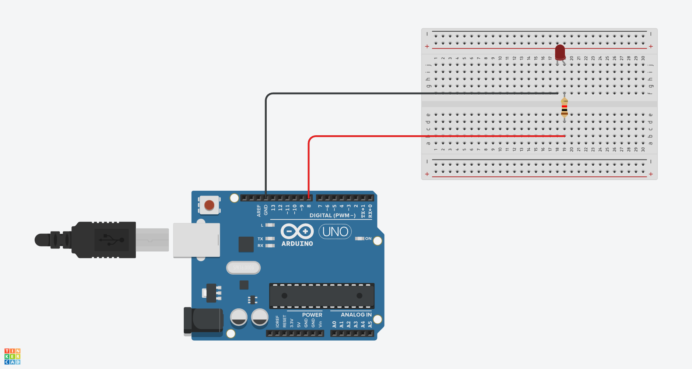

# Emisión de SOS en Código Morse con Arduino (Versión Básica)

## Materiales Necesarios
- Placa Arduino (Arduino Uno)
- LED (cualquier color)
- Resistencia de 220 ohmios
- Cables de conexión

## Esquemático


## Montaje
1. Conecta el cátodo del LED (patilla corta) a GND (tierra)
2. Conecta el ánodo del LED (patilla larga) a una resistencia de 220Ω
3. Conecta el otro extremo de la resistencia al pin 8 del Arduino 
4. Usa cables dupont para las conexiones

## El Código (Versión Básica con Variables)

```cpp
// Definición de variables para personalizar la señal
int dot = 100;         // Duración de un punto en ms
int dash = 300;        // Duración de una raya en ms
int ledPin = 8;        // Pin digital para el LED
int finalDelay = 1500; // Espera entre repeticiones en ms

void setup() {
  pinMode(ledPin, OUTPUT); // Configurar el pin del LED como salida
}

void loop() {
  // Primera letra S: ··· (tres puntos)
  // Punto 1
  digitalWrite(ledPin, HIGH);
  delay(dot);
  digitalWrite(ledPin, LOW);
  delay(dot);
  
  // Punto 2
  digitalWrite(ledPin, HIGH);
  delay(dot);
  digitalWrite(ledPin, LOW);
  delay(dot);
  
  // Punto 3
  digitalWrite(ledPin, HIGH);
  delay(dot);
  digitalWrite(ledPin, LOW);
  delay(dash); // Espacio entre letras
  
  // Letra O: --- (tres rayas)
  // Raya 1
  digitalWrite(ledPin, HIGH);
  delay(dash);
  digitalWrite(ledPin, LOW);
  delay(dot);
  
  // Raya 2
  digitalWrite(ledPin, HIGH);
  delay(dash);
  digitalWrite(ledPin, LOW);
  delay(dot);
  
  // Raya 3
  digitalWrite(ledPin, HIGH);
  delay(dash);
  digitalWrite(ledPin, LOW);
  delay(dash); // Espacio entre letras
  
  // Segunda letra S: ··· (tres puntos)
  // Punto 1
  digitalWrite(ledPin, HIGH);
  delay(dot);
  digitalWrite(ledPin, LOW);
  delay(dot);
  
  // Punto 2
  digitalWrite(ledPin, HIGH);
  delay(dot);
  digitalWrite(ledPin, LOW);
  delay(dot);
  
  // Punto 3
  digitalWrite(ledPin, HIGH);
  delay(dot);
  digitalWrite(ledPin, LOW);
  
  // Espera final antes de repetir la secuencia
  delay(finalDelay);
}
```

## Explicación del Código

1. **Variables personalizables:**
   - `dot = 100`: Duración de los puntos (S) en milisegundos
   - `dash = 300`: Duración de las rayas (O) en milisegundos
   - `ledPin = 8`: Pin digital conectado al LED
   - `finalDelay = 1500`: Tiempo de espera entre repeticiones del SOS

2. **Estructura básica:**
   - `setup()`: Configura el pin del LED como salida
   - `loop()`: Contiene la secuencia completa SOS sin usar bucles o estructuras complejas

3. **Secuencia SOS:**
   - **Primera S (···)**: Tres destellos cortos con duración `dot` (100ms)
   - **O (---)**: Tres destellos largos con duración `dash` (300ms)
   - **Segunda S (···)**: Tres destellos cortos nuevamente
   - Entre cada letra hay un espacio equivalente a `dash` (300ms)
   - Al final, `finalDelay` (1500ms) antes de repetir

4. **Temporización:**
   - Cada punto (S): 100ms encendido + 100ms apagado
   - Cada raya (O): 300ms encendido + 100ms apagado
   - Espacio entre letras: 300ms
   - Espacio entre palabras: 1500ms

## Resultado

Al ejecutar este programa:
1. El LED emitirá tres destellos cortos (S) con intervalos de 100ms
2. Pausa de 300ms entre letras
3. Tres destellos largos (O) de 300ms cada uno
4. Otra pausa de 300ms entre letras
5. Tres destellos cortos nuevamente (S)
6. Espera de 1500ms antes de repetir el ciclo completo

La ventaja de esta versión es que puedes ajustar fácilmente los tiempos modificando los valores de las variables al inicio del código, sin necesidad de cambiar múltiples valores en el cuerpo del programa.