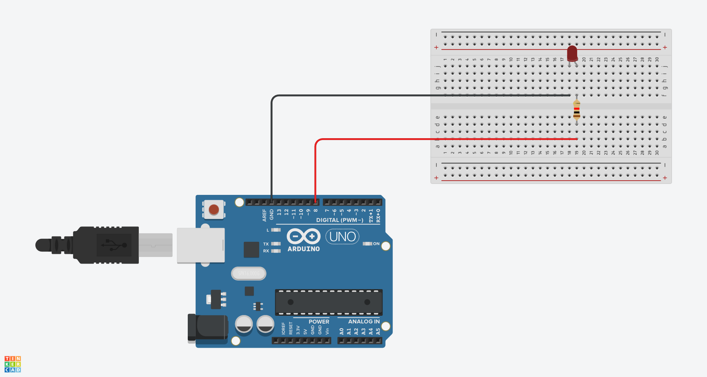

# Emisión de SOS en Código Morse con Arduino y un LED

## Materiales Necesarios
- Placa Arduino (Arduino Uno)
- LED (cualquier color)
- Resistencia de 220 ohmios
- Cables de conexión

## Esquemático


## Montaje
1. Conecta el cátodo del LED (patilla corta) a GND (tierra)
2. Conecta el ánodo del LED (patilla larga) a una resistencia de 220Ω
3. Conecta el otro extremo de la resistencia al pin 8 del Arduino 
4. Usa cables dupont para las conexiones:


## El Código

```cpp
void setup()
{
  pinMode(8, OUTPUT);
}

void loop()
{
  // Letra S: ··· (tres pulsos cortos)
  digitalWrite(8, HIGH);
  delay(50); 
  digitalWrite(8, LOW);
  delay(50);
  digitalWrite(8, HIGH);
  delay(50); 
  digitalWrite(8, LOW);
  delay(50);
  digitalWrite(8, HIGH);
  delay(50); 
  digitalWrite(8, LOW);
  delay(50);
  
  // Letra O: --- (tres pulsos largos)
  digitalWrite(8, HIGH);
  delay(500); 
  digitalWrite(8, LOW);
  delay(500);
  digitalWrite(8, HIGH);
  delay(500); 
  digitalWrite(8, LOW);
  delay(500);
  digitalWrite(8, HIGH);
  delay(500); 
  digitalWrite(8, LOW);
  delay(500);


  // Letra S: ··· (tres pulsos cortos)
  digitalWrite(8, HIGH);
  delay(50); 
  digitalWrite(8, LOW);
  delay(50);
  digitalWrite(8, HIGH);
  delay(50); 
  digitalWrite(8, LOW);
  delay(50);
  digitalWrite(8, HIGH);
  delay(50); 
  digitalWrite(8, LOW);
  delay(50);

  delay(500);
}
```

## Explicación

1. **Configuración inicial:**
   - `pinMode(8, OUTPUT)`: Configura el pin 8 como salida digital para controlar el LED.

2. **Secuencia SOS:**
   - **S (···)**: Tres pulsos cortos (50ms encendido + 50ms apagado)
   - **O (---)**: Tres pulsos largos (500ms encendido + 500ms apagado)
   - El bucle `loop()` repite continuamente la secuencia S-O-S

3. **Temporización:**
   - Punto (·): 50ms encendido
   - Raya (-): 500ms encendido (10 veces más largo que un punto)
   - Espacio entre símbolos: 50ms
   - Espacio entre letras: 500ms


## Resultado

Al ejecutar el programa, el LED emitirá continuamente la señal de SOS en código morse:
1. Tres destellos rápidos (letra S)
2. Tres destellos largos (letra O)
3. Tres destellos rápidos nuevamente (letra S)
4. Pausa antes de repetir la secuencia

La señal SOS seguirá este patrón:  
**· · ·   — — —   · · ·** (con pausas entre símbolos y letras)

¡Este proyecto es perfecto para practicar conceptos básicos de temporización y comunicación digital!