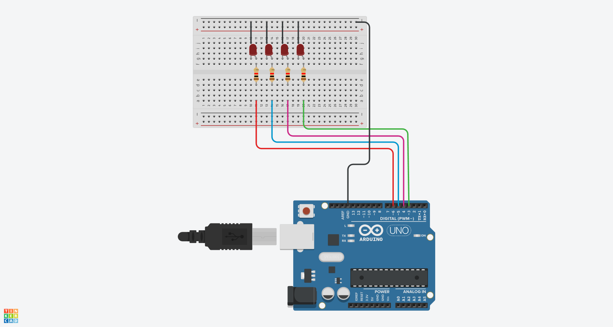

# Contador Binario de 4 Bits con Arduino

## Materiales Necesarios
- Placa Arduino (Arduino Uno)
- 4 LEDs (preferiblemente de diferentes colores)
- 4 resistencias de 220 ohmios
- Cables de conexión

## Esquemático


## Montaje
1. Conecta los cátodos (patilla corta) de los LEDs a GND a través de resistencias de 220Ω
2. Conecta los ánodos (patilla larga) de los LEDs a los pines digitales:
   - LED 1 (LSB - bit menos significativo): Pin 3
   - LED 2: Pin 4
   - LED 3: Pin 5
   - LED 4 (MSB - bit más significativo): Pin 6

## El Código Completo

```cpp
// Definición de pines para cada LED
int pin1 = 3;  // Bit menos significativo (LSB)
int pin2 = 4;
int pin3 = 5;
int pin4 = 6;  // Bit más significativo (MSB)
int delayTime = 500;  // Tiempo entre números

void setup() {
  // Configurar todos los pines como salidas
  pinMode(pin1, OUTPUT);
  pinMode(pin2, OUTPUT);
  pinMode(pin3, OUTPUT);
  pinMode(pin4, OUTPUT);
}

void loop() {
  // 0: 0000
  digitalWrite(pin1, LOW);
  digitalWrite(pin2, LOW);
  digitalWrite(pin3, LOW);
  digitalWrite(pin4, LOW);
  delay(delayTime);
  
  // 1: 0001
  digitalWrite(pin1, HIGH);
  digitalWrite(pin2, LOW);
  digitalWrite(pin3, LOW);
  digitalWrite(pin4, LOW);
  delay(delayTime);
  
  // 2: 0010
  digitalWrite(pin1, LOW);
  digitalWrite(pin2, HIGH);
  digitalWrite(pin3, LOW);
  digitalWrite(pin4, LOW);
  delay(delayTime);
  
  // 3: 0011
  digitalWrite(pin1, HIGH);
  digitalWrite(pin2, HIGH);
  digitalWrite(pin3, LOW);
  digitalWrite(pin4, LOW);
  delay(delayTime);
  
  // 4: 0100
  digitalWrite(pin1, LOW);
  digitalWrite(pin2, LOW);
  digitalWrite(pin3, HIGH);
  digitalWrite(pin4, LOW);
  delay(delayTime);
  
  // 5: 0101
  digitalWrite(pin1, HIGH);
  digitalWrite(pin2, LOW);
  digitalWrite(pin3, HIGH);
  digitalWrite(pin4, LOW);
  delay(delayTime);
  
  // 6: 0110
  digitalWrite(pin1, LOW);
  digitalWrite(pin2, HIGH);
  digitalWrite(pin3, HIGH);
  digitalWrite(pin4, LOW);
  delay(delayTime);
  
  // 7: 0111
  digitalWrite(pin1, HIGH);
  digitalWrite(pin2, HIGH);
  digitalWrite(pin3, HIGH);
  digitalWrite(pin4, LOW);
  delay(delayTime);
  
  // 8: 1000
  digitalWrite(pin1, LOW);
  digitalWrite(pin2, LOW);
  digitalWrite(pin3, LOW);
  digitalWrite(pin4, HIGH);
  delay(delayTime);
  
  // 9: 1001
  digitalWrite(pin1, HIGH);
  digitalWrite(pin2, LOW);
  digitalWrite(pin3, LOW);
  digitalWrite(pin4, HIGH);
  delay(delayTime);
  
  // 10: 1010
  digitalWrite(pin1, LOW);
  digitalWrite(pin2, HIGH);
  digitalWrite(pin3, LOW);
  digitalWrite(pin4, HIGH);
  delay(delayTime);
  
  // 11: 1011
  digitalWrite(pin1, HIGH);
  digitalWrite(pin2, HIGH);
  digitalWrite(pin3, LOW);
  digitalWrite(pin4, HIGH);
  delay(delayTime);
  
  // 12: 1100
  digitalWrite(pin1, LOW);
  digitalWrite(pin2, LOW);
  digitalWrite(pin3, HIGH);
  digitalWrite(pin4, HIGH);
  delay(delayTime);
  
  // 13: 1101
  digitalWrite(pin1, HIGH);
  digitalWrite(pin2, LOW);
  digitalWrite(pin3, HIGH);
  digitalWrite(pin4, HIGH);
  delay(delayTime);
  
  // 14: 1110
  digitalWrite(pin1, LOW);
  digitalWrite(pin2, HIGH);
  digitalWrite(pin3, HIGH);
  digitalWrite(pin4, HIGH);
  delay(delayTime);
  
  // 15: 1111
  digitalWrite(pin1, HIGH);
  digitalWrite(pin2, HIGH);
  digitalWrite(pin3, HIGH);
  digitalWrite(pin4, HIGH);
  delay(delayTime);
}
```

## Explicación del Código

1. **Configuración de pines:**
   - Cada LED representa un bit en un número binario de 4 dígitos
   - Pin 3: Bit menos significativo (2⁰ = 1)
   - Pin 4: Segundo bit (2¹ = 2)
   - Pin 5: Tercer bit (2² = 4)
   - Pin 6: Bit más significativo (2³ = 8)

2. **Funcionamiento del contador:**
   - El programa recorre todos los números del 0 al 15 (0000 a 1111 en binario)
   - Cada combinación de LEDs representa un número en binario
   - LED encendido = 1, LED apagado = 0

3. **Temporización:**
   - `delayTime = 500`: Tiempo que se muestra cada número (0.5 segundos)
   - Después de mostrar el 15, el contador vuelve a comenzar en 0

## Tabla de Valores Binarios

| Decimal | Binario | Pin 6 (8) | Pin 5 (4) | Pin 4 (2) | Pin 3 (1) |
|---------|---------|-----------|-----------|-----------|-----------|
| 0       | 0000    | LOW       | LOW       | LOW       | LOW       |
| 1       | 0001    | LOW       | LOW       | LOW       | HIGH      |
| 2       | 0010    | LOW       | LOW       | HIGH      | LOW       |
| 3       | 0011    | LOW       | LOW       | HIGH      | HIGH      |
| 4       | 0100    | LOW       | HIGH      | LOW       | LOW       |
| 5       | 0101    | LOW       | HIGH      | LOW       | HIGH      |
| 6       | 0110    | LOW       | HIGH      | HIGH      | LOW       |
| 7       | 0111    | LOW       | HIGH      | HIGH      | HIGH      |
| 8       | 1000    | HIGH      | LOW       | LOW       | LOW       |
| 9       | 1001    | HIGH      | LOW       | LOW       | HIGH      |
| 10      | 1010    | HIGH      | LOW       | HIGH      | LOW       |
| 11      | 1011    | HIGH      | LOW       | HIGH      | HIGH      |
| 12      | 1100    | HIGH      | HIGH      | LOW       | LOW       |
| 13      | 1101    | HIGH      | HIGH      | LOW       | HIGH      |
| 14      | 1110    | HIGH      | HIGH      | HIGH      | LOW       |
| 15      | 1111    | HIGH      | HIGH      | HIGH      | HIGH      |

## Resultado

Al ejecutar el programa:
- Los 4 LEDs mostrarán una secuencia que cuenta de 0 a 15 en binario
- Cada número se mantendrá visible durante 500ms
- El LED en pin 3 representa el bit menos significativo (valor 1)
- El LED en pin 6 representa el bit más significativo (valor 8)
- La secuencia comenzará nuevamente después de llegar a 15

Este proyecto es una excelente manera de visualizar el sistema binario y entender cómo se representan los números en sistemas digitales.