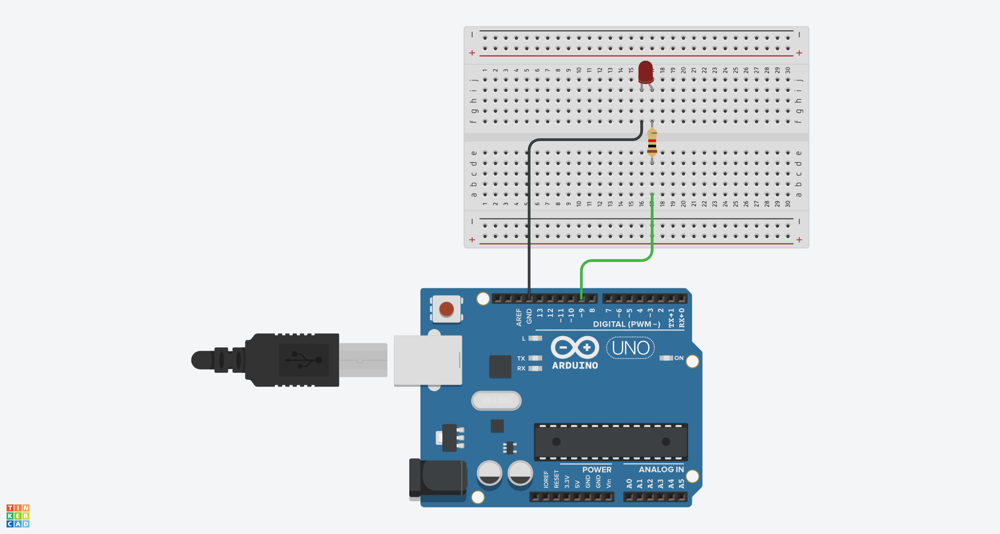
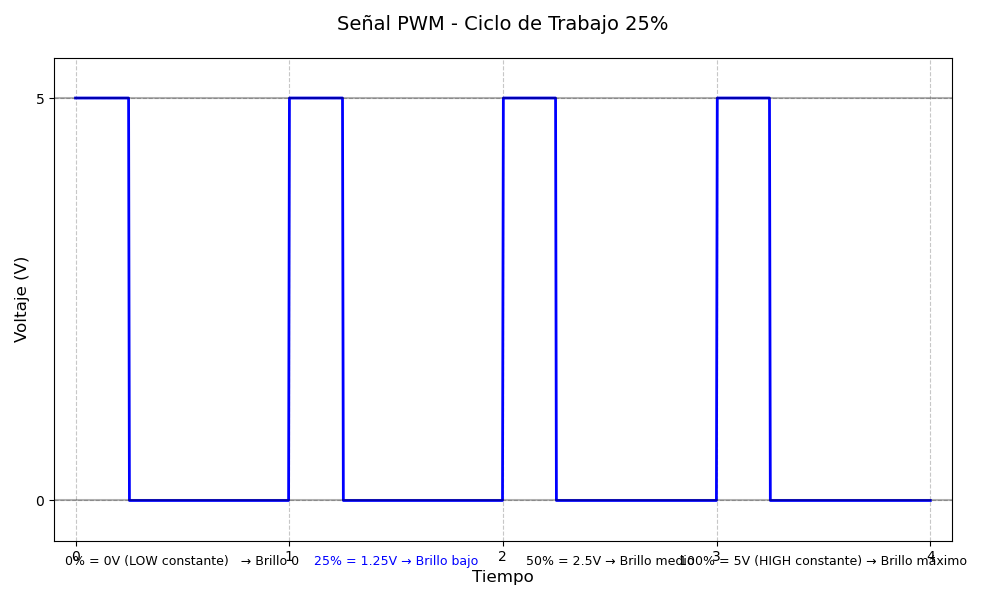
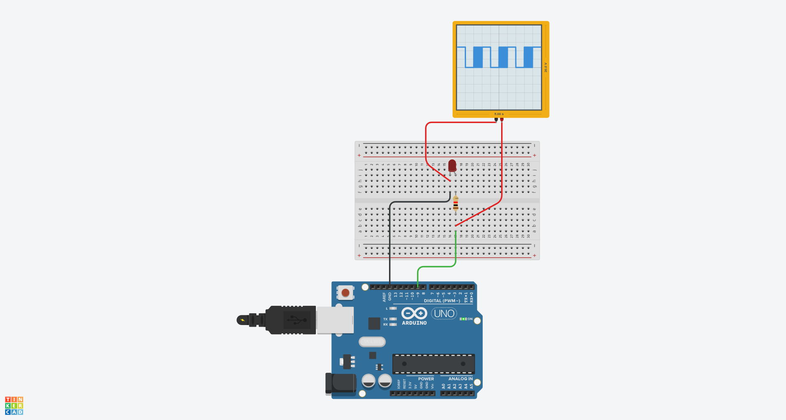

# Control de Brillo LED con PWM en Arduino

## Materiales Necesarios
- Placa Arduino (Arduino Uno)
- LED (cualquier color)
- Resistencia de 220 ohmios
- Cables de conexión

## Esquemático


## Montaje
1. Conecta el cátodo del LED (patilla corta) a GND (tierra)
2. Conecta el ánodo del LED (patilla larga) a una resistencia de 220Ω
3. Conecta el otro extremo de la resistencia al pin 9 del Arduino

## El Código

```cpp
// Definición de variables
int ledPin = 9;        // Pin PWM para el LED
int brightness1 = 0;   // Valor mínimo (apagado)
int brightness2 = 125; // Valor intermedio
int brightness3 = 255; // Valor máximo
int delayTime = 1000;  // Tiempo entre cambios

void setup() {
  pinMode(ledPin, OUTPUT); // Configurar el pin como salida
}

void loop() {
  analogWrite(ledPin, brightness1); // LED apagado
  delay(delayTime);
  
  analogWrite(ledPin, brightness2); // Brillo medio
  delay(delayTime);
  
  analogWrite(ledPin, brightness3); // Brillo máximo
  delay(delayTime);
}
```

## Explicación de PWM (Modulación por Ancho de Pulso)

El PWM es una técnica que permite simular una salida analógica mediante pulsos digitales. Funciona encendiendo y apagando rápidamente un pin digital, donde el porcentaje de tiempo que permanece encendido (ciclo de trabajo) determina el voltaje promedio.

### Gráfico de funcionamiento PWM



```

Ciclo de trabajo:
0%   = 0V (LOW constante)   -> Brillo 0
25%  = 1.25V                -> Brillo bajo
50%  = 2.5V                 -> Brillo medio
75%  = 3.75V                -> Brillo alto
100% = 5V (HIGH constante)  -> Brillo máximo
```

### Parámetros clave

1. **Ciclo de trabajo (Duty Cycle):**
   - Porcentaje de tiempo que la señal está en HIGH
   - Determina el voltaje promedio entregado al LED

2. **Rango de valores (8 bits):**
   - 0 (0% - siempre apagado)
   - 127 (~50% - mitad del brillo)
   - 255 (100% - siempre encendido)

3. **Frecuencia PWM:**
   - En Arduino Uno, la frecuencia base es de 490 Hz (pines 3,9,10,11)
   - Esto significa 490 ciclos por segundo, imperceptible al ojo humano



## Resultado del Programa

Al ejecutar este código:
1. El LED comenzará completamente apagado (0V)
2. Después de 1 segundo, cambiará a brillo medio (≈2.45V)
3. Después de otro segundo, cambiará a brillo máximo (5V)
4. La secuencia se repetirá continuamente

## Valores PWM y su Equivalencia en Voltaje

| Valor PWM | Voltaje Promedio | Ciclo de Trabajo | Estado LED |
|-----------|------------------|------------------|------------|
| 0         | 0V               | 0%               | Apagado    |
| 64        | 1.25V            | 25%              | Brillo bajo|
| 127       | 2.5V             | 50%              | Brillo medio|
| 191       | 3.75V            | 75%              | Brillo alto|
| 255       | 5V               | 100%             | Máximo brillo|

## Aplicaciones del PWM
- Control de brillo en LEDs
- Control de velocidad en motores DC
- Generación de tonos en altavoces
- Control de servomotores
- Regulación de temperatura

Este proyecto demuestra cómo los microcontroladores pueden generar señales analógicas a partir de salidas digitales, una técnica fundamental en la electrónica moderna.