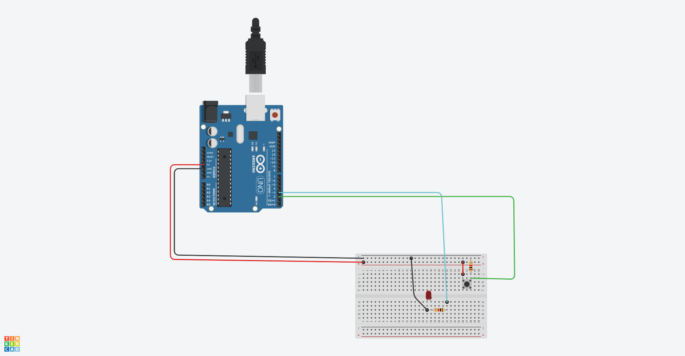

# Cómo Crear un Circuito LED con Arduino


## Materiales Necesarios
- Placa Arduino (Arduino Uno)
- LED (cualquier color)
- Resistencia de 220 ohmios
- Interruptor (puede ser un interruptor o un pulsador)
- Protoboard o placa de pruebas
- Cables de puente (jumper wires)

## Esquematico


## Paso 1: Conexiones
1. Conecta el LED al pin digital 3 de la placa Arduino. Asegúrate de conectar el ánodo (lado más largo) del LED al pin 3 y el cátodo (lado más corto) a través de una resistencia de 220 ohmios al GND (tierra) de la placa.
2. Conecta el interruptor al pin digital 2 de la placa Arduino. Un extremo del interruptor debe estar conectado al pin 2, y el otro extremo al GND.

## Paso 2: Código
```cpp
// Código para encender y apagar el LED con el interruptor
void setup()
{
  pinMode(2, INPUT); // Configura el pin 2 como entrada
  pinMode(3, OUTPUT); // Configura el pin 3 como salida
}

void loop()
{
  if (digitalRead(2) == HIGH)
  {
    digitalWrite(3, HIGH); // Enciende el LED si el interruptor está activado
  }
  else
  {
    digitalWrite(3, LOW); // Apaga el LED si el interruptor está desactivado
  }
}
```

## Paso 3: Subir el Código
1. Abre el software Arduino IDE en tu computadora.
2. Copia y pega el código anterior en un nuevo proyecto.
3. Selecciona la placa Arduino que estás utilizando (por ejemplo, Arduino Uno) y el puerto COM correspondiente.
4. Haz clic en "Subir" para cargar el código en la placa.

## Paso 4: Prueba
Conecta la placa Arduino a una fuente de alimentación (como una batería o un cable USB). Ahora, cuando actives el interruptor, el LED debería encenderse. Al soltar el interruptor, el LED se apagará.
