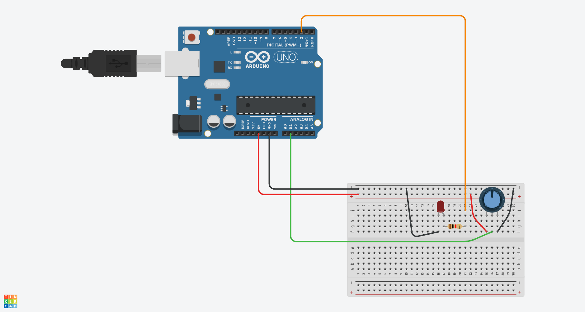

# Control de LED con Potenciómetro en Arduino

## Materiales Necesarios
- Placa Arduino (Arduino Uno)
- LED (cualquier color)
- Resistencia de 220 ohmios
- Potenciómetro
- Cables de conexión

## Esquemático


## Montaje
1. Conecta el LED:
   - Cátodo (patilla corta) a GND a través de una resistencia de 220Ω
   - Ánodo (patilla larga) al pin digital 2
2. Conecta el potenciómetro:
   - Patilla izquierda a 5V
   - Patilla derecha a GND
   - Patilla central al pin analógico A1

## El Código

```cpp
int potPin = A1;   // Pin analógico para el potenciómetro
int ledPin = 2;    // Pin digital para el LED
int potVal;        // Variable para almacenar el valor del potenciómetro
int dt = 400;      // Tiempo de retardo entre lecturas

void setup() {
  Serial.begin(9600);      // Inicia la comunicación serial
  pinMode(ledPin, OUTPUT); // Configura el pin del LED como salida
  pinMode(potPin, INPUT);  // Configura el pin del potenciómetro como entrada
}

void loop() {
  potVal = analogRead(potPin); // Lee el valor del potenciómetro (0-1023)
  Serial.println(potVal);      // Imprime el valor en el monitor serial
  delay(dt);                   // Pequeño retardo

  // Si el valor del potenciómetro es mayor a 1000, enciende el LED
  while (potVal > 1000) {
    digitalWrite(ledPin, HIGH); // Enciende el LED
    Serial.println(potVal);     // Sigue imprimiendo el valor
    potVal = analogRead(potPin); // Actualiza la lectura del potenciómetro
    delay(dt);
  }
  
  // Apaga el LED cuando el valor del potenciómetro es 1000 o menos
  digitalWrite(ledPin, LOW);
}
```

## Explicación del Código

1. **Configuración inicial:**
   - `Serial.begin(9600)`: Inicia la comunicación serial para monitoreo
   - `pinMode()` configura los pines como entrada (potenciómetro) y salida (LED)

2. **Lectura del potenciómetro:**
   - `analogRead(potPin)` lee un valor entre 0-1023 del potenciómetro
   - Este valor representa la posición del potenciómetro (0 = mínimo, 1023 = máximo)

3. **Control condicional del LED:**
   - Cuando el valor supera 1000 (umbral alto), entra en el bucle `while`
   - Dentro del bucle, el LED permanece encendido mientras se cumpla la condición
   - Se actualiza constantemente la lectura del potenciómetro
   - Cuando el valor baja de 1000, sale del bucle y apaga el LED


## Resultado

- Al girar el potenciómetro, el valor leído cambiará entre 0 y 1023
- Cuando el valor supere 1000 (≈4.88V), el LED se encenderá
- El LED permanecerá encendido mientras el potenciómetro esté en su posición máxima
- Al bajar ligeramente el potenciómetro (por debajo de 1000), el LED se apagará
- Los valores se mostrarán en el Monitor Serial (Herramientas → Monitor Serial)

## Aplicaciones Prácticas
- Sistemas de detección de nivel máximo
- Alarmas por sobrevalor
- Activación de dispositivos al alcanzar un umbral
- Pruebas de sensores con valores críticos

## Consejos para Experimentar
1. Cambia el valor umbral (1000) por otros valores (ej: 500, 800)
2. Modifica el tiempo de retardo (`dt`) para lecturas más rápidas/lentas
3. Añade un segundo LED que se active cuando el valor sea muy bajo
4. Usa `map()` para convertir el valor a voltaje real:
   ```cpp
   float voltage = map(potVal, 0, 1023, 0, 500) / 100.0;
   Serial.print("Voltaje: ");
   Serial.print(voltage);
   Serial.println("V");
   ```

Este proyecto demuestra cómo usar entradas analógicas para controlar dispositivos digitales, un concepto fundamental en la electrónica programable.