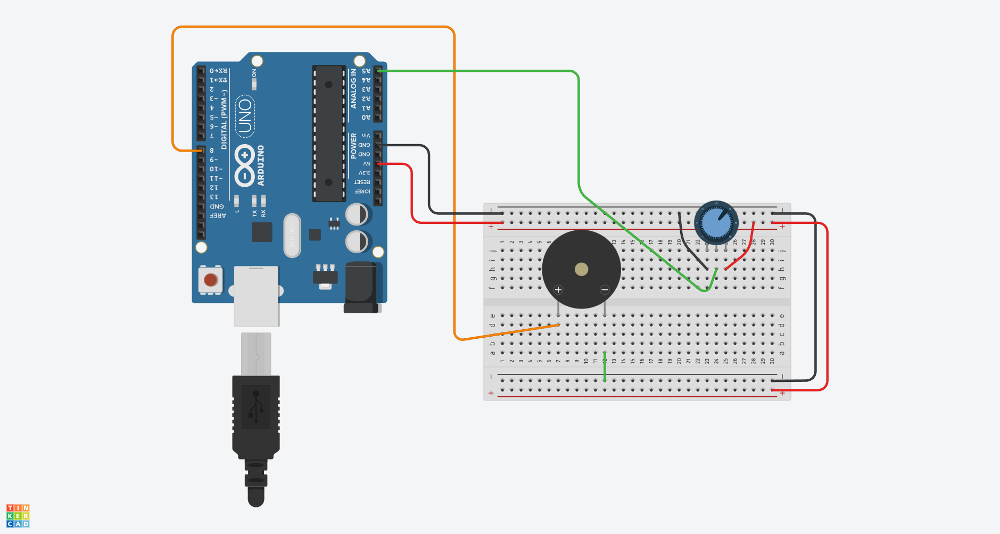

# Control de un Buzzer con Arduino y un Potenciómetro

## Materiales Necesarios
- Placa Arduino (Arduino Uno)
- Buzzer (o zumbador pasivo)
- Potenciómetro (10k ohm recomendado)
- Cables de conexión

## Esquemático


## El Código

```cpp
int buzzPin = 8;
int potVal;
int potPin = A5;

void setup() {
  Serial.begin(9600);
  pinMode(buzzPin, OUTPUT);
  pinMode(potPin, INPUT);
}

void loop() {
  potVal = analogRead(potPin);
  Serial.println(potVal);

  while (potVal > 1000) {
    digitalWrite(buzzPin, HIGH);
    potVal = analogRead(potPin);
    Serial.println(potVal);
  }
  digitalWrite(buzzPin, LOW);
}
```

## Explicación

1. **Declaración de variables:**
   - `buzzPin`: Representa el pin digital al que está conectado el buzzer.
   - `potVal`: Almacena el valor leído del potenciómetro (0-1023).
   - `potPin`: Representa el pin analógico (A5) al que está conectado el potenciómetro.

2. **Configuración inicial:**
   - En `setup()` inicializamos la comunicación serial a 9600 baudios.
   - Configuramos `buzzPin` como salida digital.
   - Configuramos `potPin` como entrada analógica.

3. **Bucle principal:**
   - Leemos el valor del potenciómetro con `analogRead(potPin)`.
   - Imprimimos el valor leído en el monitor serial.
   - Cuando el valor supera 1000 (aprox. 98% del rango):
     - Activamos el buzzer con `digitalWrite(buzzPin, HIGH)`.
     - Seguimos leyendo el potenciómetro dentro del bucle `while`.
   - Cuando el valor baja de 1000, apagamos el buzzer con `digitalWrite(buzzPin, LOW)`.

## Montaje

1. Conecta el buzzer al pin 8 del Arduino (polaridad: positivo al pin, negativo a GND).
2. Conecta el potenciómetro:
   - Terminal izquierdo: +5V
   - Terminal derecho: GND
   - Terminal central: Pin analógico A5
3. Usa cables dupont para las conexiones.

## Resultado

Al girar el potenciómetro, cuando el valor supera el 98% de su rango (aproximadamente), el buzzer se activará y permanecerá encendido mientras el valor se mantenga por encima de 1000. Al volver a valores inferiores, el buzzer se apagará. Los valores del potenciómetro se mostrarán en el monitor serial.