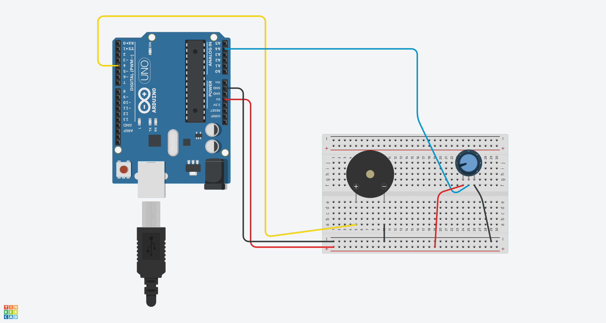
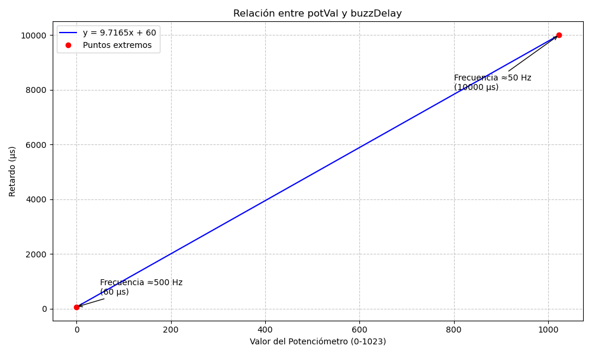

# Control de Frecuencia de un Buzzer con Arduino y Potenciómetro

## Materiales Necesarios
- Placa Arduino (Arduino Uno)
- Buzzer activo o pasivo
- Potenciómetro (10k ohm recomendado)
- Cables de conexión

## Esquemático


## El Código

```cpp
int buzzPin = 4;
float buzzDelay;
int potPin = A4;
int potVal;

void setup() {
  pinMode(buzzPin, OUTPUT);
  Serial.begin(9600);
  pinMode(potPin, INPUT);
}

void loop() {
  potVal = analogRead(potPin);
  
  // Calcula el retardo para generar diferentes frecuencias
  buzzDelay = (9940. / 1023.) * potVal + 60;
  
  // Genera la onda cuadrada
  digitalWrite(buzzPin, HIGH);
  delayMicroseconds(buzzDelay);
  digitalWrite(buzzPin, LOW);
  delayMicroseconds(buzzDelay);

  // Muestra el valor del potenciómetro en el monitor serial
  Serial.println(potVal);
}
```

## Explicación


1. **Declaración de variables:**
   - `buzzPin`: Pin digital conectado al buzzer (pin 4)
   - `buzzDelay`: Almacena el tiempo de retardo calculado para generar la frecuencia
   - `potPin`: Pin analógico conectado al potenciómetro (A4)
   - `potVal`: Almacena el valor leído del potenciómetro (0-1023)

2. **Configuración inicial:**
   - `setup()` configura el pin del buzzer como salida
   - Inicializa la comunicación serial a 9600 baudios
   - Configura el pin del potenciómetro como entrada

3. **Bucle principal:**
   - Lee el valor del potenciómetro con `analogRead(potPin)`
   - Calcula `buzzDelay` usando la fórmula `(9940./1023.)*potVal+60` que convierte el rango 0-1023 en 60-10000 microsegundos
   - Genera una onda cuadrada alternando HIGH y LOW con retardo de `buzzDelay`
   - Muestra el valor del potenciómetro en el monitor serial

### Explicación Matemática de la Fórmula
La fórmula `buzzDelay = (9940./1023.)*potVal + 60` se deriva de la ecuación de una recta:




```
m = (y₂ - y₁)/(x₂ - x₁)
```

Donde:
- **x₁ = 0** (valor mínimo del potenciómetro)
- **y₁ = 60** (retardo mínimo en µs → frecuencia máxima)
- **x₂ = 1023** (valor máximo del potenciómetro)
- **y₂ = 10000** (retardo máximo en µs → frecuencia mínima)

Sustituyendo valores:
```
m = (10000 - 60)/(1023 - 0) = 9940/1023
```

Despejando la ecuación:
```
y - y₁ = m(x - x₁)
y - 60 = (9940/1023)(x - 0)
y = (9940/1023)x + 60
```

Por lo tanto:
```
buzzDelay = (9940/1023) * potVal + 60
```


## Montaje
1. Conexión del buzzer:
   - Pin positivo (+) → Arduino pin 4
   - Pin negativo (-) → Arduino GND

2. Conexión del potenciómetro:
   - Terminal izquierdo → +5V Arduino
   - Terminal derecho → GND Arduino
   - Terminal central → Arduino pin analógico A4

3. Conexión de alimentación:
   - Conectar Arduino a fuente de alimentación o USB

## Resultado
Al girar el potenciómetro, la frecuencia del sonido del buzzer cambiará gradualmente:
- Cuando el potenciómetro está en su posición mínima (0), el buzzer produce un tono alto (≈500 Hz)
- Cuando el potenciómetro está en su posición máxima (1023), el buzzer produce un tono bajo (≈50 Hz)
- Los valores intermedios del potenciómetro generan frecuencias entre estos extremos
- El valor actual del potenciómetro se muestra constantemente en el monitor serial