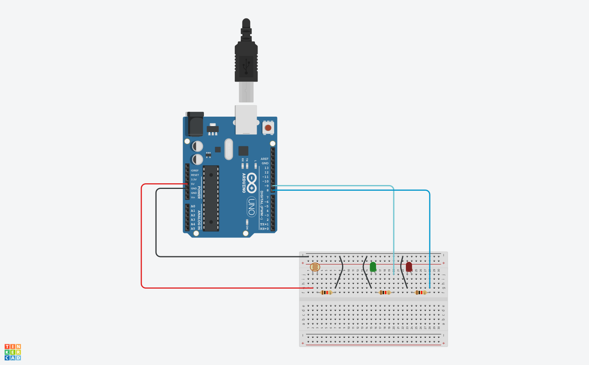

# Control de LEDs con Fotoresistencia en Arduino

Nuestro objetivo es encender un LED cuando hay poca luz (la fotoresistencia detecta oscuridad) y encender otro LED cuando hay suficiente luz (la fotoresistencia detecta luminosidad). 

## Materiales

Antes de comenzar, asegúrate de tener los siguientes materiales a mano:

1. **Arduino** (cualquier modelo compatible)
2. **1 fotoresistencia** (también conocida como LDR o célula fotoconductora)
3. **2 LEDs** (uno verde y otro rojo)
4. **2 resistencias** (aproximadamente 220 ohmios cada una)
5. **Protoboard** o placa de pruebas
6. **Cables de puente** (jumper wires)
7. **Computadora** con el software **Arduino IDE** instalado

## Esquematico



## El Código

Aquí está el código que utilizaremos para controlar los LEDs con la fotoresistencia:

```cpp
int gPin = 9; // Pin para el LED verde
int rPin = 8; // Pin para el LED rojo
int lightPin = A3; // Pin para la fotoresistencia
int lightVal;
int dt = 100; // Tiempo de espera entre lecturas

void setup() {
  Serial.begin(9600);
  pinMode(lightPin, INPUT);
  pinMode(gPin, OUTPUT);
  pinMode(rPin, OUTPUT);
}

void loop() {
  lightVal = analogRead(lightPin);
  Serial.println(lightVal);
  delay(dt);

  if (lightVal < 700) {
    digitalWrite(gPin, HIGH); // Enciende el LED verde
    digitalWrite(rPin, LOW); // Apaga el LED rojo
  }
  if (lightVal >= 700) {
    digitalWrite(gPin, LOW); // Apaga el LED verde
    digitalWrite(rPin, HIGH); // Enciende el LED rojo
  }
}
```

## Explicación

1. **Configuración de pines**: Hemos definido los pines para la fotoresistencia y los LEDs verde y rojo.
2. **Lectura de la fotoresistencia**: Utilizamos `analogRead()` para obtener el valor de la fotoresistencia.
3. **Control de LEDs**: Dependiendo del valor leído, encendemos el LED verde si hay poca luz y el LED rojo si hay suficiente luz.

