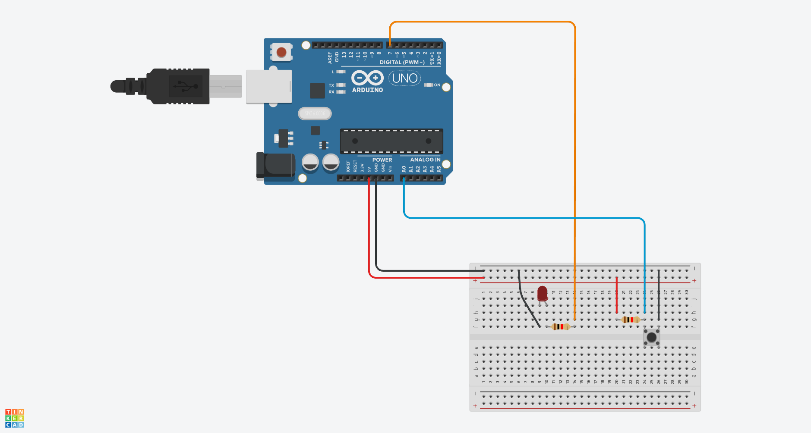

# Control de LED con Botón (Toggle) usando Arduino

## Materiales Necesarios
- Placa Arduino (Arduino Uno)
- LED (cualquier color)
- Resistencia de 220 ohmios
- Botón pulsador
- Resistencia de 10k ohmios (pull-down)
- Cables de conexión

## Esquemático


## El Código

```cpp
int ledPin = 7;
int buttonPin = A0;
int ledState = 0;
int buttonOld = 1;
int buttonNew;
int dt = 100;

void setup() {
  Serial.begin(9600);
  pinMode(ledPin, OUTPUT);
  pinMode(buttonPin, INPUT);
}

void loop() {
  buttonNew = digitalRead(buttonPin);
  delay(dt);
  
  if(buttonNew == 0 && buttonOld == 1) {
    if(ledState == 0) {
      digitalWrite(ledPin, HIGH);
      ledState = 1;
    }
    else {
      digitalWrite(ledPin, LOW);
      ledState = 0;
    }
  }
  buttonOld = buttonNew;
}
```

## Explicación

1. **Declaración de variables:**
   - `ledPin`: Pin digital conectado al LED (pin 7)
   - `buttonPin`: Pin analógico A0 usado como entrada digital para el botón
   - `ledState`: Estado actual del LED (0 = apagado, 1 = encendido)
   - `buttonOld`: Estado anterior del botón (para detección de flancos)
   - `buttonNew`: Estado actual del botón
   - `dt`: Retardo para antirrebote (100 ms)

2. **Configuración inicial:**
   - `setup()` inicia comunicación serial a 9600 baudios
   - Configura el pin del LED como salida
   - Configura el pin del botón como entrada

3. **Bucle principal:**
   - Lee el estado actual del botón con `digitalRead(buttonPin)`
   - Introduce un retardo para evitar rebotes mecánicos
   - Detecta flanco descendente (botón presionado) cuando:
     - Estado actual es 0 (presionado)
     - Estado anterior es 1 (no presionado)
   - Si se detecta presión:
     - Si LED está apagado, lo enciende y actualiza estado
     - Si LED está encendido, lo apaga y actualiza estado
   - Actualiza el estado anterior del botón

## Montaje
1. Conexión del LED:
   - Ánodo (+) → Resistencia 220Ω → Arduino pin 7
   - Cátodo (-) → GND Arduino

2. Conexión del botón:
   - Un extremo → +5V Arduino
   - Otro extremo → Resistencia 10kΩ → GND Arduino
   - Mismo extremo → Arduino pin A0

3. Conexión de alimentación:
   - Conectar Arduino a fuente de alimentación o USB

## Resultado
Al presionar el botón:
- La primera vez que se presiona, el LED se encenderá
- La siguiente vez que se presione, el LED se apagará
- Cada presión alterna el estado del LED (toggle)
- El sistema incluye protección antirrebotes para evitar cambios de estado no deseados
- El LED mantendrá su estado hasta la siguiente presión del botón