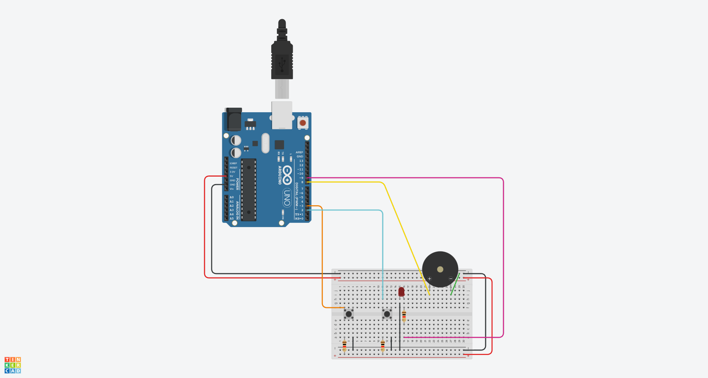

# Control de Brillo de LED con Botones y Retroalimentación de Buzzer

## Materiales Necesarios
- Placa Arduino (Arduino Uno)
- LED (cualquier color)
- Buzzer activo o pasivo
- 2 botones pulsadores
- 2 resistencias de 10k ohmios (para pull-down de botones)
- Resistencia de 220 ohmios (para el LED)
- Cables de conexión

## Esquemático


## El Código

```cpp
int pinButton1 = 3;
int pinButton2 = 2;
int ledPin = 9;
int buzzPin = 8;
int buttonNew1;
int buttonNew2;
int dt = 100;
int ledBright = 0;
int buzzDelay = 200;

void setup() {
  Serial.begin(9600);
  pinMode(pinButton1, INPUT);
  pinMode(pinButton2, INPUT);
  pinMode(ledPin, OUTPUT);
  pinMode(buzzPin, OUTPUT);
}

void loop() {
  buttonNew1 = digitalRead(pinButton1);
  buttonNew2 = digitalRead(pinButton2);
  Serial.print("Boton 1 = ");
  Serial.print(buttonNew1);
  Serial.print(" Boton 2 = ");
  Serial.println(buttonNew2);
  Serial.print("Brillo: ");
  Serial.println(ledBright);
  delay(dt);

  // Bandera para saber si debemos hacer sonar el buzzer
  bool shouldBeep = false;

  if (buttonNew1 == 0) {
    if (ledBright > 0) {
      ledBright = max(ledBright - 15, 0);  // Disminuir sin pasar de 0
    } else {
      shouldBeep = true;  // Límite inferior alcanzado
    }
  }
  
  if (buttonNew2 == 0) {
    if (ledBright < 255) {
      ledBright = min(ledBright + 15, 255);  // Aumentar sin pasar de 255
    } else {
      shouldBeep = true;  // Límite superior alcanzado
    }
  }

  // Actualizar LED solo con valores válidos
  analogWrite(ledPin, ledBright);
  
  // Activar buzzer solo si se alcanzó un límite
  if (shouldBeep) {
    digitalWrite(buzzPin, HIGH);
    delay(buzzDelay);
    digitalWrite(buzzPin, LOW);
  }
}
```

## Explicación

1. **Declaración de variables:**
   - `pinButton1` y `pinButton2`: Pines digitales para los botones (2 y 3)
   - `ledPin`: Pin PWM (9) para controlar el brillo del LED
   - `buzzPin`: Pin digital (8) para el buzzer
   - `buttonNew1` y `buttonNew2`: Estados actuales de los botones
   - `ledBright`: Valor de brillo del LED (0-255)
   - `buzzDelay`: Duración del sonido del buzzer (200 ms)

2. **Configuración inicial:**
   - `setup()` inicializa comunicación serial a 9600 baudios
   - Configura pines de botones como entradas
   - Configura pines de LED y buzzer como salidas

3. **Bucle principal:**
   - Lee estados actuales de ambos botones
   - Imprime en monitor serial: estados de botones y nivel de brillo
   - Introduce retardo para estabilización (100 ms)
   - Botón 1 (pin 3):
     - Si se presiona y brillo > 0 → disminuye brillo en 15 unidades
     - Si brillo ya es 0 → activa bandera para buzzer
   - Botón 2 (pin 2):
     - Si se presiona y brillo < 255 → aumenta brillo en 15 unidades
     - Si brillo ya es 255 → activa bandera para buzzer
   - Actualiza brillo del LED con `analogWrite()`
   - Si se alcanzó límite (brillo 0 o 255), activa buzzer brevemente

## Montaje
1. **LED:**
   - Ánodo (+) → Resistencia 220Ω → Arduino pin 9
   - Cátodo (-) → GND Arduino

2. **Buzzer:**
   - Pin positivo (+) → Arduino pin 8
   - Pin negativo (-) → GND Arduino

3. **Botones:**
   - Botón 1:
     - Un extremo → +5V Arduino
     - Otro extremo → Resistencia 10kΩ → GND
     - Mismo extremo (con resistencia) → Arduino pin 3
   - Botón 2:
     - Un extremo → +5V Arduino
     - Otro extremo → Resistencia 10kΩ → GND
     - Mismo extremo (con resistencia) → Arduino pin 2

## Resultado
- Presionar botón 2 aumenta el brillo del LED en 15 unidades por cada pulsación
- Presionar botón 1 disminuye el brillo del LED en 15 unidades por cada pulsación
- Al alcanzar brillo máximo (255) o mínimo (0), el buzzer emite un pitido de 200 ms
- El brillo se mantiene entre 0 y 255 inclusive
- El monitor serial muestra en tiempo real:
  - Estado de ambos botones (0 = presionado, 1 = no presionado)
  - Valor actual de brillo del LED (0-255)