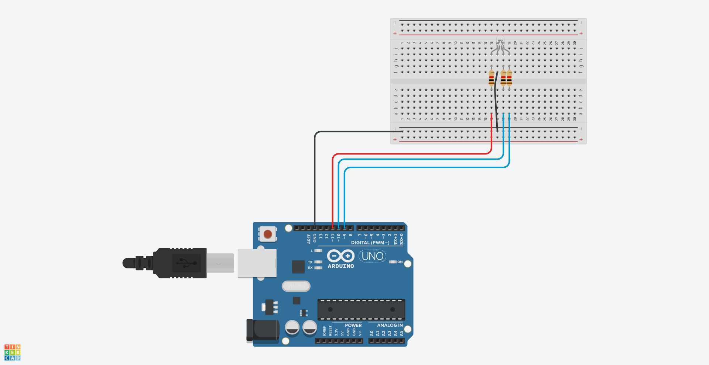

# Control de un LED RGB con Arduino

### Materiales necesarios:
- Arduino Uno o similar
- LED RGB (cátodo común)
- Resistencias de 220 Ω (3 unidades)
- Protoboard y cables de conexión
- Cable USB para conectar el Arduino a la computadora
- Computadora con el IDE de Arduino instalado

### Paso a paso:

#### **Conexiones físicas**:
   - Conecta el ánodo del LED RGB al pin 11 (rojo), el pin 10 (verde) y el pin 9 (azul) del Arduino.
   - Conecta las resistencias de 220 Ω en serie con cada uno de los pines del LED RGB.
   - Conecta el cátodo del LED RGB al GND del Arduino.

 

#### **Programación**:
   
```arduino
int redPin= 11;
int greenPin = 10;
int bluePin = 9;
String color;
String msg1 = "Por favor elige un color";

void setup() {
  // put your setup code here, to run once:
Serial.begin(9600);
pinMode(redPin, OUTPUT);
pinMode(greenPin, OUTPUT);
pinMode(bluePin, OUTPUT);
}

void loop() {
  // put your main code here, to run repeatedly:
Serial.println();
Serial.println(msg1);
while (Serial.available() == 0);{
  
}

color = Serial.readString();

if (color == "rojo"){
  digitalWrite(redPin, HIGH);
  digitalWrite(greenPin, LOW);
  digitalWrite(bluePin, LOW);
}


if (color == "verde"){
  digitalWrite(redPin, LOW);
  digitalWrite(greenPin, HIGH);
  digitalWrite(bluePin, LOW);
}


if (color == "azul"){
  digitalWrite(redPin, LOW);
  digitalWrite(greenPin, LOW);
  digitalWrite(bluePin, HIGH);
}

if (color == "cian"){
  analogWrite(redPin, 0);
  analogWrite(greenPin, 255);
  analogWrite(bluePin, 255);
}

if (color == "magenta"){
  analogWrite(redPin, 255);
  analogWrite(greenPin, 0);
  analogWrite(bluePin, 255);
}

if (color == "amarillo"){
  analogWrite(redPin, 255);
  analogWrite(greenPin, 255);
  analogWrite(bluePin, 0);
}

if (color == "naranjado"){
  analogWrite(redPin, 255);
  analogWrite(greenPin, 100);
  analogWrite(bluePin, 0);
}
}
```

#### **Explicación del código**:
   - El programa comienza mostrando un mensaje en el monitor serial: "Por favor elige un color".
   - Espera a que el usuario ingrese un color (por ejemplo, "rojo", "verde", "azul", etc.).
   - Dependiendo del color ingresado, el programa enciende o ajusta la intensidad de los pines correspondientes para lograr el color deseado en el LED RGB.

#### **Funcionamiento**:
   - Cuando ingresas "rojo", se enciende solo el LED rojo.
   - Cuando ingresas "verde", se enciende solo el LED verde.
   - Cuando ingresas "azul", se enciende solo el LED azul.
   - Puedes experimentar con otros colores como "cian", "magenta", "amarillo" y "naranjado".

#### **Resultado**:
   - Al ejecutar el programa, podrás controlar el LED RGB mediante el monitor serial de Arduino.

