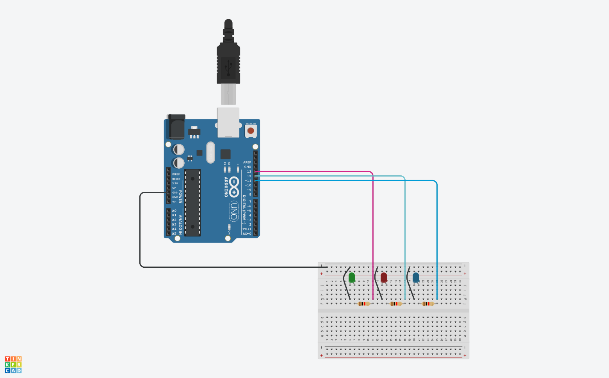

# Control de LEDs con Arduino

objetivo es encender los LEDs en función del color que se indica a través del monitor serial.

## Materiales

Antes de comenzar, asegúrate de tener los siguientes materiales a mano:

1. **Arduino** (cualquier modelo compatible)
2. **3 LEDs** (de los colores verde, rojo y azul)
3. **3 resistencias** (aproximadamente 220 ohmios cada una)
4. **Protoboard** o placa de pruebas
5. **Cables de puente** (jumper wires)
6. **Computadora** con el software **Arduino IDE** instalado

## Esquemático



## El Código

Aquí está el código que utilizaremos para controlar los LEDs:

```cpp
int greenPin = 13;
int redPin = 12;
int bluePin = 11;
int ledColor;
String msg1 = "Escribe un color de led";

void setup() {
  Serial.begin(115200);
  pinMode(greenPin, OUTPUT);
  pinMode(redPin, OUTPUT);
  pinMode(bluePin, OUTPUT);
}

void loop() {
  Serial.println();
  Serial.println(msg1);
  
  while (Serial.available() == 0) {
    // Espera a que se ingrese un valor por el monitor serial
  }

  ledColor = Serial.parseInt();

  switch (ledColor) {
    case 1:
      digitalWrite(greenPin, HIGH);
      digitalWrite(redPin, LOW);
      digitalWrite(bluePin, LOW);
      break;

    case 2:
      digitalWrite(greenPin, LOW);
      digitalWrite(redPin, HIGH);
      digitalWrite(bluePin, LOW);
      break;

    case 3:
      digitalWrite(greenPin, LOW);
      digitalWrite(redPin, LOW);
      digitalWrite(bluePin, HIGH);
      break;

    default:
      digitalWrite(greenPin, LOW);
      digitalWrite(redPin, LOW);
      digitalWrite(bluePin, LOW);
      Serial.println("El valor es incorrecto. Intenta de nuevo");
  }
}
```

## Explicación

1. **Configuración de pines**: Hemos definido los pines para los LEDs verde, rojo y azul.
2. **Mensaje inicial**: Mostramos un mensaje en el monitor serial para que el usuario ingrese un número correspondiente al color deseado.
3. **Switch-case**: Dependiendo del valor ingresado, encendemos el LED correspondiente y apagamos los demás.

## Resultado

Carga el código en tu Arduino, abre el monitor serial y prueba ingresando los números 1, 2 o 3. Verás cómo los LEDs se encienden en los colores verde, rojo o azul según tu elección. 🚀🔌💡