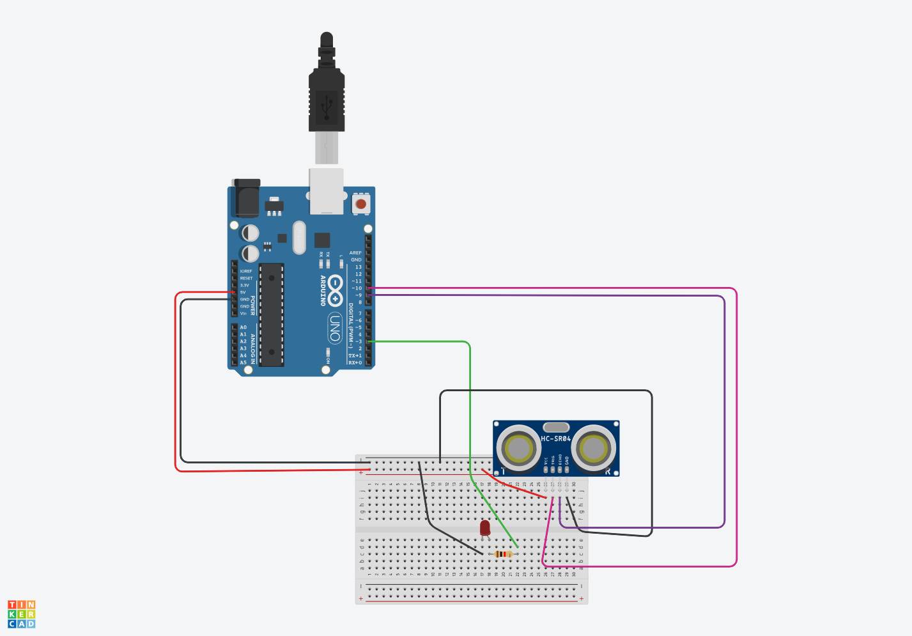

# Detector de Objetos con Arduino
## Materiales Necesarios
- Placa Arduino (Arduino Uno)
- LED (cualquier color)
- Resistencia de 220 ohmios
- Sensor ultrasónico de proximidad (HC-SR04)
- Cables de conexión
- Protoboard

## Esquematico


## Paso 1: Conexiones
1. Conecta el sensor de proximidad al Arduino:
   - **TRIG** del sensor al pin **10** del Arduino.
   - **ECO** del sensor al pin **9** del Arduino.
2. Conecta el LED:
   - **Ánodo (+)** del LED al pin **3** del Arduino.
   - **Cátodo (-)** del LED a través de una resistencia al **GND** del Arduino.

## Paso 2: Programación
```cpp
int TRIG = 10;
int ECO = 9;
int LED = 3;
int DURACION;
int DISTANCIA;

void setup() {
  pinMode(TRIG, OUTPUT);
  pinMode(ECO, INPUT);
  pinMode(LED, OUTPUT);
  Serial.begin(9600);
}

void loop() {
  digitalWrite(TRIG, HIGH);
  delayMicroseconds(10);
  digitalWrite(TRIG, LOW);
  DURACION = pulseIn(ECO, HIGH);
  DISTANCIA = DURACION / 58.2;
  Serial.println(DISTANCIA);
  delay(200);
  
  if (DISTANCIA <= 20 && DISTANCIA >= 0) {
    digitalWrite(LED, HIGH);
    delay(DISTANCIA * 10);
    digitalWrite(LED, LOW);
  }
}
```

## Explicación
1. **Conexiones**: Hemos conectado el sensor de proximidad y el LED al Arduino según las especificaciones.

2. **Programación**:
   - El sensor envía un pulso ultrasónico y mide el tiempo que tarda en recibir el eco.
   - Calculamos la distancia en centímetros utilizando la fórmula: `DISTANCIA = DURACION / 58.2`.
   - Si la distancia es menor o igual a 20 cm, el LED se enciende durante un tiempo proporcional a la distancia medida.

3. **Declaración de variables**:
    - `int TRIG = 10;`: Aquí se declara una variable llamada `TRIG` y se le asigna el valor `10`. Esta variable representa el pin al que está conectado el transmisor ultrasónico (el sensor de distancia).
    - `int ECO = 9;`: Similar al anterior, se declara la variable `ECO` con el valor `9`. Este pin está conectado al receptor ultrasónico.
    - `int LED = 3;`: La variable `LED` se inicializa con el valor `3`, que corresponde al pin al que está conectado el LED.

4. **Configuración inicial** (`setup()`):
    - `pinMode(TRIG, OUTPUT);`: Configura el pin `TRIG` como una salida (para enviar señales al sensor ultrasónico).
    - `pinMode(ECO, INPUT);`: Configura el pin `ECO` como una entrada (para recibir señales del sensor ultrasónico).
    - `pinMode(LED, OUTPUT);`: Configura el pin `LED` como una salida (para encender o apagar el LED).
    - `Serial.begin(9600);`: Inicializa la comunicación serial a una velocidad de 9600 baudios.

5. **Bucle principal** (`loop()`):
    - `digitalWrite(TRIG, HIGH);`: Envía un pulso alto al pin `TRIG` durante 1 milisegundo.
    - `delay(1);`: Espera 1 milisegundo.
    - `digitalWrite(TRIG, LOW);`: Establece el pin `TRIG` en bajo.
    - `DURACION = pulseIn(ECO, HIGH);`: Mide la duración del pulso recibido en el pin `ECO` cuando está en alto.
    - `DISTANCIA = DURACION / 58.2;`: Calcula la distancia en centímetros dividiendo la duración por 58.2 (basado en la velocidad del sonido).
    - `Serial.println(DISTANCIA);`: Imprime la distancia medida en el monitor serial.
    - `delay(200);`: Espera 200 milisegundos.
    - `if (DISTANCIA <= 20 && DISTANCIA >= 0) { ... }`: Si la distancia está entre 0 y 20 cm, enciende el LED durante un tiempo proporcional a la distancia.