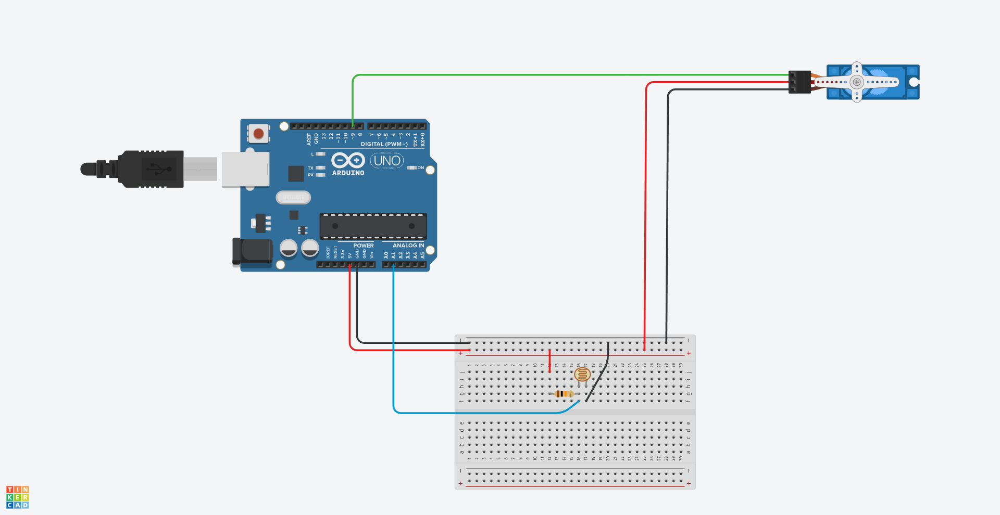

# Control de Servo según la Luz con Arduino


### Materiales

Para este proyecto, necesitarás:

1. **Arduino**: Puede ser cualquier modelo compatible con servos.
2. **Servo Motor**: Utilizaremos un servo para el movimiento.
3. **Fotosensor (LDR)**: Para medir la cantidad de luz.
4. **Cables y resistencias**: Para conectar los componentes.
5. **Protoboard o placa de pruebas**: Para ensamblar el circuito.

### Montaje del Circuito

1. Conecta el servo al pin 9 del Arduino.
2. Conecta el fotosensor (LDR) al pin A1.
3. Asegúrate de que todos los cables estén correctamente conectados.



### Código

```cpp
#include <Servo.h>

int servoPin = 9;
int servoPos = 170;
int lightPin = A1;
int lightVal;
Servo myServo;

void setup() {
  myServo.attach(servoPin);
  Serial.begin(9600);
  pinMode(lightPin, INPUT);
}

void loop() {
  lightVal = analogRead(lightPin);
  Serial.println(lightVal);
  servoPos = (170. / 500.) * (lightVal - 500.);
  myServo.write(servoPos);
}
```

### Explicación

1. **Configuración**: En la función `setup()`, inicializamos el servo y configuramos el pin del fotosensor como entrada.
2. **Bucle Principal**: En la función `loop()`, leemos el valor del fotosensor y lo imprimimos en el monitor serial. Luego, calculamos la posición del servo en función de la cantidad de luz detectada.

### Resultado

Cuando expongas el fotosensor a diferentes niveles de luz, verás cómo el servo se mueve en consecuencia. 
