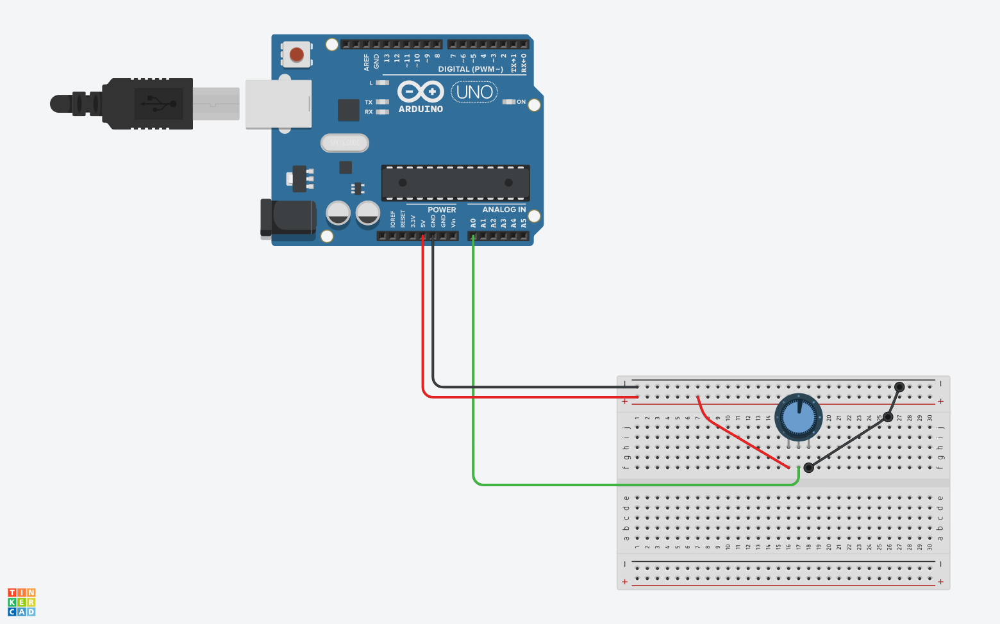

# Medición de Voltaje con Potenciómetro

En esta práctica, aprenderemos cómo utilizar un potenciómetro para medir el voltaje en un pin analógico de Arduino. El objetivo es leer el valor del potenciómetro y convertirlo en una lectura de voltaje comprensible.

### Esquematico



### Materiales
- Arduino (cualquier modelo compatible)
- Potenciómetro (resistencia variable)
- Protoboard
- Cables de conexión
- Computadora con el IDE de Arduino instalado

### Paso 1: Configuración Inicial

Primero, definimos las variables necesarias:

```arduino
float vOut; // Almacena el voltaje calculado
float vRead; // Se refiere al pin analógico utilizado para leer el valor del potenciómetro.
int dt = 100; // Representa el tiempo de retardo entre lecturas en milisegundos
float analogVal; // Almacena el valor leído del pin analógico conectado al potenciómetro.
```
En la función `setup()`, configuramos el pin del potenciómetro como entrada y habilitamos la comunicación serial:

```arduino
void setup() {
  pinMode(vRead, INPUT); // Configurar el pin del potenciómetro como entrada
  Serial.begin(9600); // Iniciar comunicación serial a 9600 bps
}
```

### Paso 2: Lectura y Cálculo del Voltaje
En la función `loop()`, leemos el valor analógico del potenciómetro, lo convertimos a voltaje y lo imprimimos en el monitor serial:

```cpp
void loop() {
  analogVal = analogRead(vRead); // Leer valor analógico del potenciómetro
  vOut = (5.0 * analogVal) / 1023.0; // Calcular voltaje (escala de 0 a 5V)
  Serial.print("El voltaje actual es: "); // Imprimir mensaje
  Serial.print(vOut); // Imprimir el valor del voltaje
  Serial.println(" Voltios"); // Imprimir unidad
  delay(dt); // Esperar antes de la siguiente lectura
}
```

- `analogRead(vRead)`: Lee el valor analógico del potenciómetro.
- `vOut = (5.0 * analogVal) / 1023.0`: Calcula el voltaje utilizando la relación entre el valor leído y la escala de 0 a 5V.
- `Serial.print("El voltaje actual es: ")`: Imprime un mensaje descriptivo.
- `Serial.print(vOut)`: Imprime el valor del voltaje.
- `Serial.println(" Voltios")`: Imprime la unidad de medida.
- `delay(dt)`: Espera antes de la siguiente lectura.

### Resultado
Al cargar este código en tu Arduino y girar el potenciómetro, podrás ver el voltaje medido en el monitor serial. ¡Experimenta con diferentes posiciones del potenciómetro y observa cómo cambia el voltaje!

Recuerda que este es solo un ejemplo básico. Puedes expandirlo agregando más funcionalidades o aplicándolo a proyectos más complejos. ¡Diviértete explorando el mundo de Arduino! 🤖🔌