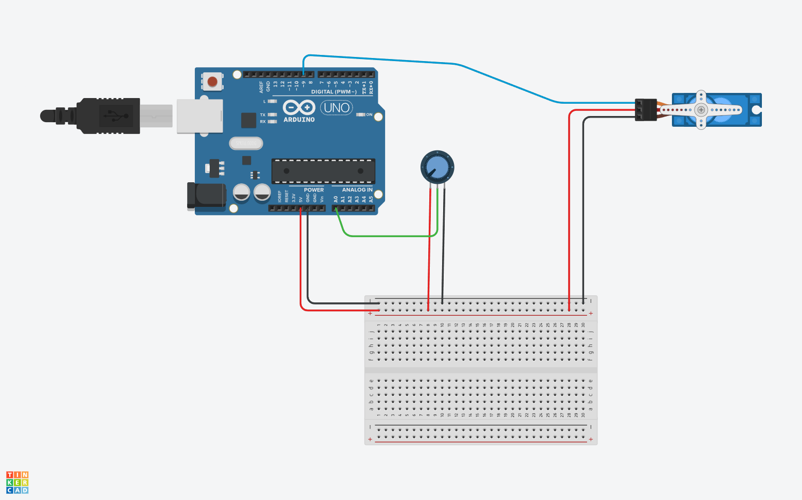

# Control de un Servomotor con un Potenciómetro en Arduino


En esta práctica, aprenderemos cómo utilizar un potenciómetro para controlar un servomotor utilizando una placa Arduino. El servomotor es un dispositivo que puede girar a una posición específica dentro de su rango de operación y mantenerse estable en esa posición. El potenciómetro nos permitirá ajustar la posición del servomotor manualmente.

## Materiales
- Placa Arduino Uno
- Tarjeta Protoboard
- Potenciómetro rotatorio
- Servomotor

## Montaje del Circuito
1. Conecta el cable rojo del servomotor al pin de 5V en la placa Arduino. Esto proporcionará la alimentación al servomotor.
2. El cable amarillo (señal) del servomotor debe ir conectado al pin 9. Elegimos el pin 9 porque permite señales moduladas (PWM).
3. Conecta el cable blanco del potenciómetro al pin A5 en la placa Arduino.
4. Los cables rojos desde el servomotor hasta el potenciómetro deben conectarse a tierra (GND).



### Programación en el IDE de Arduino
```cpp
#include <Servo.h>

Servo Servo1;

int servoPin = 9;
int potPin = A0;

void setup() {
    Servo1.attach(servoPin);
}

void loop() {
    int reading = analogRead(potPin);
    int angle = map(reading, 0, 1023, 0, 180);
    Servo1.write(angle);
}
```

## Explicación
1. Importamos la librería `Servo.h`.
2. Creamos un objeto `Servo` llamado `Servo1`.
3. En el `setup()`, adjuntamos el servomotor al pin 9.
4. En el `loop()`, leemos el valor del potenciómetro (0-1023) y mapeamos ese valor al rango de ángulos del servomotor (0-180).

