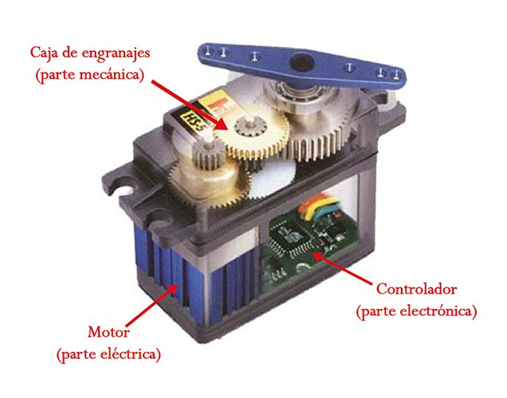

# **Arduino: Más Allá de la Electrónica Convencional**

¡Bienvenidos, entusiastas de la electrónica y creadores de futuros brillantes! En este viaje por el fascinante mundo de Arduino, desentrañaremos sus raíces, exploraremos sus múltiples facetas y nos sumergiremos en la creación de nuestro propio proyecto. Prepara tu mente creativa, ¡comencemos!


#### **¿Qué es Arduino?**
Arduino no es solo un microcontrolador; es una revolución creativa. Es una plataforma de hardware libre basada en un microcontrolador, principalmente Atmel AVR. Lo esencial: una PCB con todos los elementos necesarios. Pero la magia radica en su IDE libre y su lenguaje de programación propio, simplificado para acercar la electrónica a todos, sin importar los conocimientos previos o los recursos económicos.


#### **Historia de Arduino: De Italia al Mundo**
El año 2005 marcó el nacimiento de Arduino en Italia. Estudiantes del Instituto de diseño Interactivo IVREA, buscando alternativas asequibles, crearon una plataforma basada en Atmel AVR. El proyecto, liderado por Massimo Banzi, David Cuartilles y Gianluca Martino, desplazó soluciones costosas del mercado, llevando la creatividad a nuevas alturas.


#### **Innovación con Simplicidad: El Éxito de Arduino**
La sencillez de Arduino proviene de su IDE y el bootloader en el microcontrolador, permitiendo la programación directa mediante un simple cable USB. Compatible con diversos sistemas operativos, desde Windows hasta Linux y MacOS, Arduino se convierte en una herramienta accesible y poderosa para todos.


#### **Arduino en Evolución: Más Allá del Comienzo**
Tras su lanzamiento, Arduino no dejó de evolucionar. Desde el Kit ADK de Google para comunicarse con smartphones Android hasta el desarrollo de placas Arduino 32 bit y contribuciones de Intel con la placa Galileo, el proyecto se expandió y diversificó. Incluso surgieron compatibles y sistemas similares, pero la esencia de Arduino persiste.


#### **Modelos de Arduino: Un Universo de Posibilidades**
- **Arduino Uno:** La clásica. 

- **Arduino Leonardo:** Con procesador ATmega32U4. 

- **Arduino Due:** Potencia con ARM Cortex. 

- **Arduino Yún:** Integración de Linux. 

- **Arduino Mega 2560:** Para proyectos extensos. 

- **Arduino Micro:** Pequeño pero poderoso. 
- **Arduino Nano:** Compacto y versátil. 

- **Arduino Pro Mini, Fio, Esplora:** Adaptabilidad en diversas situaciones. 


#### **¿Qué Hacer con Arduino? ¡Todo es Posible!**
- **Automatización del hogar:** Luces, persianas, electrodomésticos.

- **Robótica:** Desde juguetes hasta proyectos complejos.

- **Arte interactivo:** Donde la creatividad se encuentra con la tecnología.

- **Monitoreo con sensores:** Medición de temperatura, humedad, y más.


#### **El Encanto del IDE Arduino**
El entorno de desarrollo de Arduino es una joya para los amantes de la programación. Basado en C y C++, su simplicidad lo hace accesible para principiantes, mientras que su potencia satisface a los expertos. ¡Programar con Arduino es una experiencia que engancha!


#### **Arduino en la Educación y la Industria**
Desde aulas hasta fábricas, Arduino ha dejado huella. Su enfoque en la educación ha permitido que estudiantes de todas las edades se sumerjan en la electrónica y la programación de manera divertida y educativa. Además, en la industria, su versatilidad lo ha convertido en un aliado invaluable para la creación de prototipos y soluciones personalizadas.


#### **Explorando Funciones y Librerías**
Las funciones de Arduino, desde la gestión de E/S digitales hasta el manejo del tiempo, abren un abanico de posibilidades para los creadores. Además, las librerías simplifican el control de distintos dispositivos, facilitando la integración de sensores, módulos y shields en nuestros proyectos.

### **¡Inspírate y Crea con Arduino!**
Arduino es la puerta de entrada a un universo de posibilidades. ¡Inspírate en la creatividad de Arduino, explora nuevos proyectos y deja que la innovación electrónica guíe tus creaciones! 🌌💡🛠️

## El Lenguaje de Programación de Arduino: C++ con un Toque Especial

Cuando hablamos del lenguaje de programación de Arduino, estamos principalmente en el territorio de **C++**. Pero espera, no te asustes si no eres un gurú de la programación. Aquí está la magia: **Arduino ha adaptado C++ para que sea más accesible y amigable para principiantes**. Así que, incluso si eres nuevo en esto, ¡no te preocupes!

### ¿Por qué C++?

- **Control Total**: C++ es un lenguaje estructurado y de alto nivel que te permite tener un mayor control sobre el hardware. Si eres un entusiasta de los detalles técnicos, C++ es tu amigo.
- **Eficiencia**: C++ está diseñado para ser eficiente en el uso de recursos. Esto significa que tus programas en Arduino serán rápidos y eficaces.

### ¿Qué es Wiring?

**Wiring** es el nombre del lenguaje de programación específico de Arduino. Está basado en C++ y viene con una serie de librerías y funciones que hacen que la programación sea más sencilla. Piensa en Wiring como el "idioma común" que conecta a los programadores con las placas Arduino.

## Las Piezas del Rompecabezas: Funciones, Variables y Constantes

### Funciones

Las funciones son como pequeños bloques de construcción que le dicen a Arduino qué hacer. Algunas funciones comunes incluyen:

- `digitalRead()`: Lee el estado de un pin digital.
- `analogWrite()`: Controla la intensidad de una señal analógica.

### Variables y Constantes

- **Variables**: Almacenan valores temporales (como temperaturas o estados).
- **Constantes**: Son valores fijos que no cambian durante la ejecución del programa.

## ¡Hora de Programar!

Aquí tienes un ejemplo sencillo de cómo encender un LED utilizando Arduino:

```cpp
void setup() {
  pinMode(LED_BUILTIN, OUTPUT); // Configura el pin del LED como salida
}

void loop() {
  digitalWrite(LED_BUILTIN, HIGH); // Enciende el LED
  delay(1000); // Espera 1 segundo
  digitalWrite(LED_BUILTIN, LOW); // Apaga el LED
  delay(1000); // Espera otro segundo
}
```

Este código configura el LED incorporado en la placa Arduino para que parpadee cada segundo. ¡Simple pero efectivo!

## El Lenguaje de Programación de Arduino: C++ con un Toque Especial

Cuando hablamos del lenguaje de programación de Arduino, estamos principalmente en el territorio de **C++**. Pero espera, no te asustes si no eres un gurú de la programación. Aquí está la magia: **Arduino ha adaptado C++ para que sea más accesible y amigable para principiantes**. Así que, incluso si eres nuevo en esto, ¡no te preocupes!

### ¿Por qué C++?

- **Control Total**: C++ es un lenguaje estructurado y de alto nivel que te permite tener un mayor control sobre el hardware. Si eres un entusiasta de los detalles técnicos, C++ es tu amigo.
- **Eficiencia**: C++ está diseñado para ser eficiente en el uso de recursos. Esto significa que tus programas en Arduino serán rápidos y eficaces.

### ¿Qué es Wiring?

**Wiring** es el nombre del lenguaje de programación específico de Arduino. Está basado en C++ y viene con una serie de librerías y funciones que hacen que la programación sea más sencilla. Piensa en Wiring como el "idioma común" que conecta a los programadores con las placas Arduino.

## Las Piezas del Rompecabezas: Funciones, Variables y Constantes

### Funciones

Las funciones son como pequeños bloques de construcción que le dicen a Arduino qué hacer. Algunas funciones comunes incluyen:

- `digitalRead()`: Lee el estado de un pin digital.
- `analogWrite()`: Controla la intensidad de una señal analógica.

### Variables y Constantes

- **Variables**: Almacenan valores temporales (como temperaturas o estados).
- **Constantes**: Son valores fijos que no cambian durante la ejecución del programa.

## ¡Hora de Programar!

Aquí tienes un ejemplo sencillo de cómo encender un LED utilizando Arduino:

```cpp
void setup() {
  pinMode(LED_BUILTIN, OUTPUT); // Configura el pin del LED como salida
}

void loop() {
  digitalWrite(LED_BUILTIN, HIGH); // Enciende el LED
  delay(1000); // Espera 1 segundo
  digitalWrite(LED_BUILTIN, LOW); // Apaga el LED
  delay(1000); // Espera otro segundo
}
```

Este código configura el LED incorporado en la placa Arduino para que parpadee cada segundo. ¡Simple pero efectivo!

## **Señales Analógicas en Arduino**

### **1. ¿Qué es una señal analógica?**
Antes de sumergirnos en las funciones, es importante entender qué es una señal analógica. A diferencia de las señales digitales que solo pueden tener dos estados (alto o bajo), las señales analógicas pueden tener **infinitos valores**. Por ejemplo, el voltaje en un enchufe de casa es una señal analógica que puede variar continuamente entre 0 y 220 voltios (o 120 voltios, según la región).

### **2. analogRead()**
La función `analogRead(pin)` se utiliza para **leer el valor analógico** de un pin específico. Esta función convierte la tensión en ese pin en un número entre 0 y 1023. Aquí tienes un ejemplo:

```arduino
int potPin = A0; // Pin analógico conectado al potenciómetro
int ledPin = 9; // LED conectado al pin digital 9
int val = 0; // Variable para almacenar el valor leído

void setup() {
  pinMode(ledPin, OUTPUT); // Configura el pin del LED como salida
}

void loop() {
  val = analogRead(potPin); // Lee el valor del potenciómetro
  analogWrite(ledPin, val / 4); // Controla el brillo del LED
}
```

En este ejemplo, el LED se iluminará proporcionalmente al valor leído del potenciómetro. Los valores de `analogRead` van de 0 a 1023, mientras que los valores de `analogWrite` van de 0 a 255.

### **3. analogWrite()**
La función `analogWrite(pin, value)` se utiliza para **escribir una señal PWM (modulación por ancho de pulso)** en un pin. Puede usarse para encender un LED a diferentes niveles de brillo o para controlar la velocidad de un motor. Por ejemplo:

```arduino
int ledPin = 6; // LED conectado al pin digital 6

void setup() {
  pinMode(ledPin, OUTPUT); // Configura el pin del LED como salida
}

void loop() {
  analogWrite(ledPin, 128); // Enciende el LED al 50% de brillo
  delay(1000); // Espera 1 segundo
  analogWrite(ledPin, 0); // Apaga el LED
  delay(1000); // Espera 1 segundo
}
```

En este caso, el LED se atenuará al 50% de brillo y luego se apagará alternativamente cada segundo.

# Diodo

[](https://www.youtube.com/watch?v=aPY3I8pG478)


## ¿Qué es un Diodo?
Un **diodo** es un dispositivo semiconductor que actúa como un interruptor unidireccional para la corriente eléctrica. Imagina un puente que solo permite cruzar en una dirección, pero bloquea el camino de regreso. Así es como funciona un diodo.

## Polarización Directa e Inversa
Cuando un diodo permite que la corriente fluya en su dirección preferida, se encuentra en **polarización directa**. Por otro lado, cuando bloquea la corriente en la dirección opuesta, está en **polarización inversa**. Curiosamente, el símbolo del diodo apunta en sentido contrario al flujo real de electrones. Los ingenieros diseñaron esto para seguir la convención de la corriente convencional (de positivo a negativo).

## Estructura de un Diodo
Los diodos están formados por una **unión PN**, que combina dos tipos de materiales semiconductores: uno tipo P y otro tipo N. Los electrones fluyen solo en una dirección a través de esta unión. Es como si los diodos tuvieran un sentido único de tráfico electrónico.

## Aplicaciones Creativas
Aquí hay algunas ideas creativas para usar diodos:

1. **Luces intermitentes**: Utiliza diodos para crear luces intermitentes en tus proyectos electrónicos.
2. **Detectores de luz**: Construye un sensor de luz utilizando un diodo para activar o desactivar algo cuando la luz cambia.
3. **Generador de energía solar casero**: Los diodos son esenciales en paneles solares para convertir la luz solar en electricidad.

# LED

[](https://www.youtube.com/watch?v=dZz3eAnsspY)

# Potencia tus proyectos con diodos LED: la iluminación del futuro

Los **diodos LED** (Light Emitting Diodes, por sus siglas en inglés) son componentes electrónicos esenciales en la construcción de circuitos de iluminación. Aunque pequeños en tamaño, su bajo consumo de energía y larga vida útil los hacen ideales para una amplia variedad de aplicaciones creativas. En este blog, exploraremos el fascinante mundo de los diodos LED y cómo pueden revolucionar tus proyectos.

## ¿Qué son los diodos LED?

Los diodos LED son dispositivos semiconductores que emiten luz cuando una corriente eléctrica pasa a través de ellos. A diferencia de las bombillas tradicionales, los LED no tienen filamento y no generan calor significativo. Esto los hace altamente eficientes y duraderos.

## Beneficios de los diodos LED en proyectos de iluminación

1. **Eficiencia energética**: Los LED consumen menos energía que las bombillas convencionales, lo que se traduce en ahorro en la factura eléctrica.
2. **Larga vida útil**: Los diodos LED pueden durar hasta 25,000 horas o más, reduciendo la necesidad de reemplazo frecuente.
3. **Versatilidad**: Se pueden utilizar en una variedad de aplicaciones, desde iluminación de interiores hasta espectáculos y señalizaciones.

## Explorando posibilidades creativas

### 1. Iluminación ambiental

Los diodos LED son ideales para crear ambientes acogedores. Puedes incorporarlos en muebles, estanterías o incluso debajo de la cama para una iluminación suave y relajante.

### 2. Señalización y decoración

Utiliza LED para resaltar áreas específicas, como escaleras o pasillos. También puedes diseñar letreros personalizados o crear patrones luminosos en tus proyectos.

### 3. Moda y diseño

Integra diodos LED en prendas de vestir para efectos sorprendentes. ¿Por qué no añadir luces intermitentes a tu chaqueta o crear un vestido brillante para una ocasión especial?


[](https://www.youtube.com/watch?v=PugXcHWBt_M)


# La Ley de Ohm: Descifrando el Misterio Eléctrico

Hoy nos sumergiremos en el intrigante mundo de la **Ley de Ohm**, una fórmula matemática que nos desvela los secretos detrás de los circuitos eléctricos. Así que, ajusten sus voltímetros y prepárense para un viaje lleno de electrones y resistencias.


## La Ley de Ohm en Tres Palabras: Voltaje, Corriente y Resistencia

La Ley de Ohm nos dice que la **corriente eléctrica** que fluye a través de un conductor es directamente proporcional al **voltaje** aplicado y, a su vez, inversamente proporcional a la **resistencia** del circuito. En otras palabras, es como si la electricidad tuviera su propio mantra: "Voltaje, Corriente y Resistencia, ¡todos juntos en armonía!"

## Las Fórmulas Mágicas

Aquí están las tres fórmulas mágicas que nos permiten desentrañar los misterios eléctricos:

1. **Corriente (I)**: La cantidad de electrones que fluyen por un conductor. Se expresa en **amperios (A)**.
   - I = V / R

2. **Voltaje (V)**: La diferencia de potencial entre dos puntos. Piensen en él como la fuerza que impulsa a los electrones. Se mide en **voltios (V)**.
   - V = I · R

3. **Resistencia (R)**: El obstáculo que la corriente encuentra en su camino. Cuanto mayor sea, más difícil será para la corriente vencerlo. La unidad de resistencia es el **ohmio (Ω)**.
   - R = V / I

## Ejemplos Prácticos

1. Imaginen un cable eléctrico con una resistencia baja (como un tobogán resbaladizo). La corriente fluirá rápidamente, ¡como niños bajando por el tobogán!
2. Ahora, pongan una resistencia alta (como una pared de ladrillos) en el camino. La corriente se arrastrará lentamente, como si los niños intentaran escalar la pared.

## Aplicaciones en la Vida Real

La Ley de Ohm está en todas partes:
- **Bombillas**: La resistencia de una bombilla determina su brillo. ¡Más resistencia, menos luz!
- **Electrodomésticos**: ¿Por qué la tostadora se calienta? Porque la resistencia interna convierte la electricidad en calor.
- **Circuitos electrónicos**: Los diseñadores de circuitos aplican la Ley de Ohm para crear dispositivos inteligentes.


[](https://www.youtube.com/watch?v=blUimcoNpKs)

# Monitor serial

El **monitor serie** es una herramienta esencial en el mundo de Arduino. A través de esta consola, podemos comunicarnos con nuestra placa, depurar programas y obtener información valiosa sobre el funcionamiento de nuestro código. En este blog, exploraremos cómo funciona el monitor serie, sus funciones básicas y los estándares que debemos tener en cuenta.

## ¿Qué es el Monitor Serie?

El monitor serie es una consola de entrada y salida que nos permite interactuar con nuestra placa Arduino a través del puerto serial. Algunas de sus funciones clave son:

1. **Visualización de Datos**: Podemos mostrar valores de variables, mensajes de texto y resultados de cálculos en tiempo real.
2. **Depuración**: Es una herramienta invaluable para encontrar errores en nuestro código.
3. **Comunicación Bidireccional**: Podemos enviar y recibir datos entre la placa y la computadora.

## Funciones Básicas del Monitor Serie

### `Serial.begin()`

Esta función establece la velocidad de transmisión de datos en bits por segundo (baudios). Algunas velocidades comunes son 9600, 115200, etc. También podemos especificar la configuración (número de datos, paridad y bits de parada).

```cpp
void setup() {
  Serial.begin(9600); // Configura la comunicación a 9600 baudios
}
```

### `Serial.print()`

Envía datos desde la placa Arduino al monitor serie. Puede ser cualquier tipo de dato: caracteres, cadenas, números enteros, etc.

```cpp
void loop() {
  int sensorValue = analogRead(A0);
  Serial.print("Valor del sensor: ");
  Serial.println(sensorValue);
}
```

### `Serial.end()`

Cierra el canal serie, liberando los pines RX y TX para otras funciones.


## ¿Qué es un servomotor?


[](https://www.youtube.com/watch?v=qbKmI6_V_V8)




Un servomotor es un tipo especial de motor eléctrico con dos características clave:
1. **Mantiene una posición específica**: Puede mantener una posición que le indiquemos, siempre que esté dentro de su rango de operación.
2. **Control de velocidad de giro**: Podemos ajustar la velocidad de giro y hacer que espere antes de moverse a la siguiente posición.

### Características técnicas del servomotor
En este tutorial, utilizaremos un **Micro Servo 9g SG90 de Tower Pro**. Algunos detalles importantes:
- Ángulo de giro: Puede barrer entre **-90° y 90°**, lo que equivale a un ángulo total de **180°**.
- Resolución: Debido a la limitación de la señal PWM generada por Arduino UNO, la resolución máxima es de **1 grado**.

### Conexionado con Arduino
Las conexiones son sencillas:
1. **Tierra (GND)**: Conecta el cable negro del servomotor a GND en Arduino.
2. **Alimentación (5V)**: Conecta el cable rojo del servomotor a 5V en Arduino.
3. **Señal (PWM)**: Conecta el cable amarillo o blanco del servomotor a un pin PWM en Arduino.

### Programación del servomotor
1. **Incorpora la librería** necesaria: Ve a **Programa > Include Library > Servo**.
2. **Declaración del objeto servoMotor**:
    ```cpp
    #include <Servo.h>
    Servo servoMotor; // Declaramos un objeto servoMotor
    ```
3. **Configuración y control**:
    - **attach**: Indica el pin al que está conectado el servo.
    - **write**: Establece el ángulo deseado (de 0° a 180°).
    ```cpp
    void setup() {
        servoMotor.attach(pinServo); // Asigna el pin al servo
    }

    void loop() {
        // Gira el servomotor de 0° a 180° en incrementos de 1 grado
        for (int angle = 0; angle <= 180; angle++) {
            servoMotor.write(angle);
            delay(20); // Espera 20 ms antes de cambiar de posición
        }
    }
    ```
